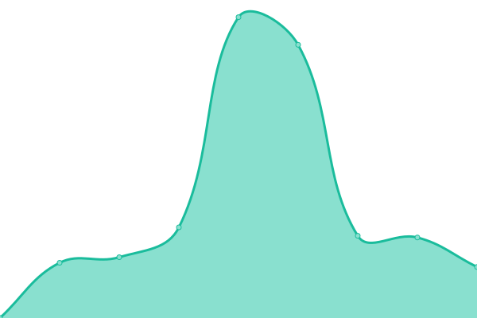

# [📈 Live Status](https://demo.upptime.js.org): <!--live status--> **🟩 All systems operational**

This repository contains the open-source uptime monitor and status page for [developerciar](https://demo.upptime.js.org), powered by [Upptime](https://github.com/upptime/upptime).

With [Upptime](https://upptime.js.org), you can get your own unlimited and free uptime monitor and status page, powered entirely by a GitHub repository. We use [Issues](https://github.com/developerciar/st_apps/issues) as incident reports, [Actions](https://github.com/developerciar/st_apps/actions) as uptime monitors, and [Pages](https://demo.upptime.js.org) for the status page.

<!--start: status pages-->
<!-- This summary is generated by Upptime (https://github.com/upptime/upptime) -->
<!-- Do not edit this manually, your changes will be overwritten -->
<!-- prettier-ignore -->
| URL | Status | History | Response Time | Uptime |
| --- | ------ | ------- | ------------- | ------ |
|  [Ceres](http://erp.clusterciar.com.ar) | 🟩 Up | [ceres.yml](https://github.com/developerciar/st_apps/commits/HEAD/history/ceres.yml) | 

 1142ms
     
 | 

<a href="https://developerciar.github.io/st_apps/history/ceres">99.39%</a>
    

|  [N1](http://n1.clusterciar.com.ar) | 🟩 Up | [n1.yml](https://github.com/developerciar/st_apps/commits/HEAD/history/n1.yml) | 

 1202ms
     
 | 

<a href="https://developerciar.github.io/st_apps/history/n1">99.51%</a>
    

|  [N2](http://n2.clusterciar.com.ar) | 🟩 Up | [n2.yml](https://github.com/developerciar/st_apps/commits/HEAD/history/n2.yml) | 

 789ms
     
 | 

<a href="https://developerciar.github.io/st_apps/history/n2">99.52%</a>
    

|  [wa](http://ws.clusterciar.com.ar) | 🟩 Up | [wa.yml](https://github.com/developerciar/st_apps/commits/HEAD/history/wa.yml) | 

 1152ms
     
 | 

<a href="https://developerciar.github.io/st_apps/history/wa">99.74%</a>
    

<!--end: status pages-->

[**Visit our status website →**](https://demo.upptime.js.org)

## 📄 License

- Powered by: [Upptime](https://github.com/upptime/upptime)
- Code: [MIT](./LICENSE) © [developerciar](https://demo.upptime.js.org)
- Data in the `./history` directory: [Open Database License](https://opendatacommons.org/licenses/odbl/1-0/)
